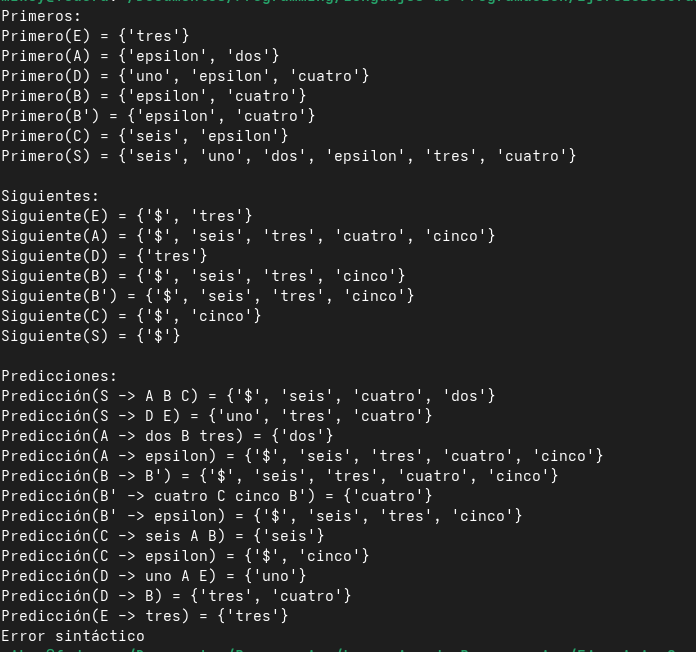
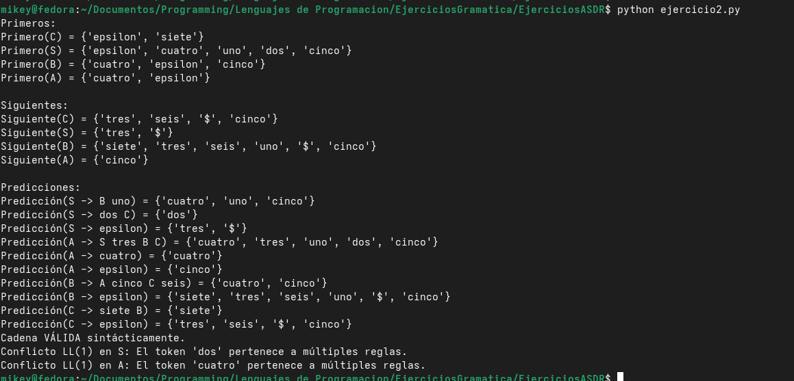
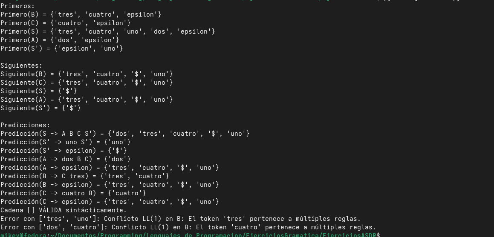

# Ejercicios ASDR

# Ejercicio 1:

## a.) Eliminación de la Recursividad por la izquierda:

- `S  -> A B C | D E`
- `A  -> dos B tres | ε`
- `B  -> B'`
- `B' -> cuatro C cinco B' | ε`
- `C  -> seis A B | ε`
- `D  -> uno A E | B`
- `E  -> tres`

## b.) Calculo de la gramática resultante

### Primeros:

- `PRIMERO(S) = { dos, cuatro, seis, uno, tres, ε }`
- `PRIMERO(A) = { dos, ε }`
- `PRIMERO(B) = { cuatro, ε }`
- `PRIMERO(B') = { cuatro, ε }`
- `PRIMERO(C) = { seis, ε }`
- `PRIMERO(D) = { uno, cuatro, ε }`
- `PRIMERO(E) = { tres }`

### Siguientes:

- `SIGUIENTE(S) = { $ }`
- `SIGUIENTE(A) = { cuatro, seis, $, cinco, tres }`
- `SIGUIENTE(B) = { cuatro, seis, $, cinco, tres }`
- `SIGUIENTE(B') = { cuatro, seis, $, cinco, tres }`
- `SIGUIENTE(C) = { cinco, $ }`
- `SIGUIENTE(D) = { tres }`
- `SIGUIENTE(E) = { tres }`

### Predicciones:

- `PREDICCIÓN(S -> A B C) = { dos, cuatro, seis, $ }`
- `PREDICCIÓN(S -> D E) = { uno, cuatro, tres }`
- `PREDICCIÓN(A -> dos B tres) = { dos }`
- `PREDICCIÓN(A -> ε) = { cuatro, seis, $, cinco, tres }`
- `PREDICCIÓN(B -> B') = { cuatro, seis, $, tres, cinco }`
- `PREDICCIÓN(B' -> cuatro C cinco B') = { cuatro }`
- `PREDICCIÓN(B' -> ε) = { seis, $, tres, cinco }`
- `PREDICCIÓN(C -> seis A B) = { seis }`
- `PREDICCIÓN(C -> ε) = { $, cinco }`
- `PREDICCIÓN(D -> uno A E) = { uno }`
- `PREDICCIÓN(D -> B) = { cuatro, tres }`
- `PREDICCIÓN(E -> tres) = { tres }`

### Definición de la gramática:

¿Es LL(1)?:

- No, no es LL(1), esto es de acuerdo con las reglas del Análisis Sintáctico Descendente, para que una gramática cumpla la condición LL(1), no deben existir símbolos comunes en los conjuntos de predicción de las reglas de un mismo no terminal.

* `PREDICCIOˊN(S→ABC)={dos, cuatro, seis, $}`
* `PREDICCIOˊN(S→DE)={uno, cuatro, tres}`

Como podemos observar, el no terminal 'S' tiene dos reglas de producción y en sus conjuntos de predicción existe el símbolo 'cuatro', por lo tanto, no es LL(1).

### Código Fuente con la implementación del ASDR

```python

# Autor: Miguel Celis

gramatica = {
    'S': [['A', 'B', 'C'], ['D', 'E']],
    'A': [['dos', 'B', 'tres'], ['epsilon']],
    'B': [["B'"]],
    "B'": [['cuatro', 'C', 'cinco', "B'"], ['epsilon']],
    'C': [['seis', 'A', 'B'], ['epsilon']],
    'D': [['uno', 'A', 'E'], ['B']],
    'E': [['tres']]
}

no_terminales = {'S', 'A', 'B', "B'", 'C', 'D', 'E'}
terminales = {'uno', 'dos', 'tres', 'cuatro', 'cinco', 'seis'}
simbolo_inicial = 'S'

memo_primeros = {}
memo_siguientes = {}
predicciones = {}

def get_primeros(simbolo, visitados=None):
    if visitados is None:
        visitados = set()

    if simbolo in memo_primeros:
        return memo_primeros[simbolo]
    if simbolo in terminales or simbolo == 'epsilon':
        return {simbolo}

    if simbolo in visitados:
        return set()

    visitados.add(simbolo)
    resultado = set()

    for produccion in gramatica[simbolo]:
        for s in produccion:
            primeros_s = get_primeros(s, visitados.copy())
            resultado.update(primeros_s - {'epsilon'})
            if 'epsilon' not in primeros_s:
                break
        else:
            resultado.add('epsilon')

    memo_primeros[simbolo] = resultado
    return resultado

def primeros_de_cadena(cadena):
    resultado = set()
    if not cadena:
        return {'epsilon'}
    for simbolo in cadena:
        primeros_s = get_primeros(simbolo)
        resultado.update(primeros_s - {'epsilon'})
        if 'epsilon' not in primeros_s:
            return resultado
    resultado.add('epsilon')
    return resultado

def get_siguientes(simbolo, visitados=None):
    if visitados is None:
        visitados = set()
    if simbolo in memo_siguientes:
        return memo_siguientes[simbolo]
    if simbolo in visitados:
        return set()

    visitados.add(simbolo)
    resultado = set()

    if simbolo == simbolo_inicial:
        resultado.add('$')

    for nt, producciones in gramatica.items():
        for produccion in producciones:
            for i, s in enumerate(produccion):
                if s == simbolo:
                    resto_derecha = produccion[i+1:]
                    primeros_resto = primeros_de_cadena(resto_derecha)

                    resultado.update(primeros_resto - {'epsilon'})

                    if 'epsilon' in primeros_resto:
                        if nt != simbolo:
                            resultado.update(get_siguientes(nt, visitados.copy()))

    memo_siguientes[simbolo] = resultado
    return resultado

for nt in no_terminales:
    get_primeros(nt)

for nt in no_terminales:
    get_siguientes(nt)

for nt, producciones in gramatica.items():
    for produccion in producciones:
        regla_texto = f"{nt} -> {' '.join(produccion)}"
        primeros_produccion = primeros_de_cadena(produccion)

        conjunto_prediccion = primeros_produccion - {'epsilon'}

        if 'epsilon' in primeros_produccion:
            conjunto_prediccion.update(memo_siguientes[nt])

        predicciones[regla_texto] = conjunto_prediccion

print("Primeros:")
for nt in no_terminales:
    print(f"Primero({nt}) = {memo_primeros[nt]}")

print("\nSiguientes:")
for nt in no_terminales:
    print(f"Siguiente({nt}) = {memo_siguientes[nt]}")

print("\nPredicciones:")
for regla, prediccion in predicciones.items():
    print(f"Predicción({regla}) = {prediccion}")


# IMPLEMENTACIÓN DEL ANALIZADOR SINTÁCTICO DESCENDENTE RECURSIVO (ASDR)

tokens_entrada = []
token_actual = ""
indice_token = 0

def obtener_siguiente_token():
    global indice_token
    if indice_token < len(tokens_entrada):
        token = tokens_entrada[indice_token]
        indice_token += 1
        return token
    return "$"

def emparejar(token_esperado):
    global token_actual
    if token_actual == token_esperado:
        token_actual = obtener_siguiente_token()
    else:
        raise Exception(f"Error sintáctico: ")

def S():
    if token_actual == 'cuatro':
        # CONFLICTO LL(1): 'cuatro' está en la predicción de S -> A B C y S -> D E
        raise Exception("Conflicto LL(1) en S")
    elif token_actual in {'dos', 'seis', '$'}:
        A()
        B()
        C()
    elif token_actual in {'uno', 'tres'}:
        D()
        E()
    else:
        raise Exception(f"Error sintáctico")

def A():
    if token_actual == 'dos':
        emparejar('dos')
        B()
        emparejar('tres')
    elif token_actual in {'cuatro', 'seis', '$', 'cinco', 'tres'}:
        pass # Deriva en epsilon
    else:
        raise Exception(f"Error sintáctico")

def B():
    if token_actual in {'cuatro', 'seis', '$', 'tres', 'cinco'}:
        B_prima()
    else:
        raise Exception(f"Error sintáctico")

def B_prima():
    if token_actual == 'cuatro':
        emparejar('cuatro')
        C()
        emparejar('cinco')
        B_prima()
    elif token_actual in {'seis', '$', 'tres', 'cinco'}:
        pass # Deriva en epsilon
    else:
        raise Exception(f"Error sintáctico")

def C():
    if token_actual == 'seis':
        emparejar('seis')
        A()
        B()
    elif token_actual in {'$', 'cinco'}:
        pass # Deriva en epsilon
    else:
        raise Exception(f"Error sintáctico")

def D():
    if token_actual == 'uno':
        emparejar('uno')
        A()
        E()
    elif token_actual in {'cuatro', 'tres'}:
        B()
    else:
        raise Exception(f"Error sintáctico")

def E():
    if token_actual == 'tres':
        emparejar('tres')
    else:
        raise Exception(f"Error sintáctico")

def analizar_cadena(cadena_tokens):
    global tokens_entrada, token_actual, indice_token
    tokens_entrada = cadena_tokens
    indice_token = 0
    token_actual = obtener_siguiente_token()

    try:
        S()
        if token_actual == '$':
            print("Cadena VÁLIDA sintácticamente.")
        else:
            print(f"Error: La cadena no fue consumida en su totalidad. Sobra '{token_actual}'.")
    except Exception as e:
        print(e)

if __name__ == "__main__":
    analizar_cadena(['uno', 'tres'])
    analizar_cadena(['cuatro', 'cinco'])

```

### ¿Cómo compilar?

- Dentro de la terminal, ingresar al directorio del proyecto y ejecutar de esta forma:

```bash
python ejercicio1.py
```

- El resultado de la ejecución es el siguiente:



# Ejercicio 2

### Gramática:

- `S -> B uno | dos C | ε`
- `A -> S tres B C | cuatro | ε`
- `B -> A cinco C seis | ε`
- `C -> siete B | ε`

### a,b,c.) Calculo de los Primeros, Siguientes y Conjuntos de Predicción

**a.) Primeros**

- `PRIMERO(S) = { uno, dos, tres, cuatro, cinco, ε }`

- `PRIMERO(A) = { uno, dos, tres, cuatro, cinco, ε }`

- `PRIMERO(B) = { uno, dos, tres, cuatro, cinco, ε }`

- `PRIMERO(C) = { siete, ε }`

**b.) Siguientes**

- `SIGUIENTE(S) = { $, tres }`

- `SIGUIENTE(A) = { cinco }`

- `SIGUIENTE(B) = { uno, siete, cinco, $, tres, seis }`

- `SIGUIENTE(C) = { $, tres, cinco, seis }`

**c.) Conjuntos de Predicción**

- `PREDICCIÓN(S -> B uno) = { uno, dos, tres, cuatro, cinco }`

- `PREDICCIÓN(S -> dos C) = { dos }`

- `PREDICCIÓN(S -> ε) = { $, tres }`

- `PREDICCIÓN(A -> S tres B C) = { uno, dos, tres, cuatro, cinco }`

- `PREDICCIÓN(A -> cuatro) = { cuatro }`

- `PREDICCIÓN(A -> ε) = { cinco }`

- `PREDICCIÓN(B -> A cinco C seis) = { uno, dos, tres, cuatro, cinco }`

- `PREDICCIÓN(B -> ε) = { uno, siete, cinco, $, tres, seis }`

- `PREDICCIÓN(C -> siete B) = { siete }`

- `PREDICCIÓN(C -> ε) = { $, tres, cinco, seis }`

### d.) Es LL(1)?

No, no es LL1, esto es debido a que para que una gramática cumpla la condición LL(1), las predicciones de las diferentes reglas que pertenecen a un mismo no terminal no deben tener ningún símbolo en común

El conflicto radica en:

- `PREDICCIÓN(S -> B uno) = { uno, dos, tres, cuatro, cinco }`

- `PREDICCIÓN(S -> dos C) = { dos }`

Ambas reglas comparten el terminal 'dos'. Si el analizador lee 'dos', no sabrá qué camino tomar.

Al igual que:

- `PREDICCIÓN(B -> A cinco C seis) = { uno, dos, tres, cuatro, cinco }`

- `PREDICCIÓN(B -> ε) = { uno, siete, cinco, $, tres, seis }`

Ambas reglas comparten los terminales 'uno', 'tres' y 'cinco'.

### Código Fuente:

```python

gramatica = {
    'S': [['B', 'uno'], ['dos', 'C'], ['epsilon']],
    'A': [['S', 'tres', 'B', 'C'], ['cuatro'], ['epsilon']],
    'B': [['A', 'cinco', 'C', 'seis'], ['epsilon']],
    'C': [['siete', 'B'], ['epsilon']]
}

no_terminales = {'S', 'A', 'B', 'C'}
terminales = {'uno', 'dos', 'tres', 'cuatro', 'cinco', 'seis', 'siete'}
simbolo_inicial = 'S'

memo_primeros = {}
memo_siguientes = {}
predicciones = {}

def get_primeros(simbolo, visitados=None):
    if visitados is None:
        visitados = set()

    if simbolo in memo_primeros:
        return memo_primeros[simbolo]
    if simbolo in terminales or simbolo == 'epsilon':
        return {simbolo}

    if simbolo in visitados:
        return set()

    visitados.add(simbolo)
    resultado = set()

    for produccion in gramatica[simbolo]:
        for s in produccion:
            primeros_s = get_primeros(s, visitados.copy())
            resultado.update(primeros_s - {'epsilon'})
            if 'epsilon' not in primeros_s:
                break
        else:
            resultado.add('epsilon')

    memo_primeros[simbolo] = resultado
    return resultado

def primeros_de_cadena(cadena):
    resultado = set()
    if not cadena:
        return {'epsilon'}
    for simbolo in cadena:
        primeros_s = get_primeros(simbolo)
        resultado.update(primeros_s - {'epsilon'})
        if 'epsilon' not in primeros_s:
            return resultado
    resultado.add('epsilon')
    return resultado

def get_siguientes(simbolo, visitados=None):
    if visitados is None:
        visitados = set()
    if simbolo in memo_siguientes:
        return memo_siguientes[simbolo]
    if simbolo in visitados:
        return set()

    visitados.add(simbolo)
    resultado = set()

    if simbolo == simbolo_inicial:
        resultado.add('$')

    for nt, producciones in gramatica.items():
        for produccion in producciones:
            for i, s in enumerate(produccion):
                if s == simbolo:
                    resto_derecha = produccion[i+1:]
                    primeros_resto = primeros_de_cadena(resto_derecha)

                    resultado.update(primeros_resto - {'epsilon'})

                    if 'epsilon' in primeros_resto:
                        if nt != simbolo:
                            resultado.update(get_siguientes(nt, visitados.copy()))

    memo_siguientes[simbolo] = resultado
    return resultado

for nt in no_terminales:
    get_primeros(nt)

for nt in no_terminales:
    get_siguientes(nt)

for nt, producciones in gramatica.items():
    for produccion in producciones:
        regla_texto = f"{nt} -> {' '.join(produccion)}"
        primeros_produccion = primeros_de_cadena(produccion)

        conjunto_prediccion = primeros_produccion - {'epsilon'}

        if 'epsilon' in primeros_produccion:
            conjunto_prediccion.update(memo_siguientes[nt])

        predicciones[regla_texto] = conjunto_prediccion

print("Primeros:")
for nt in no_terminales:
    print(f"Primero({nt}) = {memo_primeros[nt]}")

print("\nSiguientes:")
for nt in no_terminales:
    print(f"Siguiente({nt}) = {memo_siguientes[nt]}")

print("\nPredicciones:")
for regla, prediccion in predicciones.items():
    print(f"Predicción({regla}) = {prediccion}")


# IMPLEMENTACIÓN DEL ANALIZADOR SINTÁCTICO DESCENDENTE RECURSIVO (ASDR)


tokens_entrada = []
token_actual = ""
indice_token = 0

def obtener_siguiente_token():
    global indice_token
    if indice_token < len(tokens_entrada):
        token = tokens_entrada[indice_token]
        indice_token += 1
        return token
    return "$"

def emparejar(token_esperado):
    global token_actual
    if token_actual == token_esperado:
        token_actual = obtener_siguiente_token()
    else:
        raise Exception(f"Error sintáctico: Se esperaba '{token_esperado}', pero se encontró '{token_actual}'")

def S():
    # CONFLICTO: 'dos' y 'tres' pertenecen a más de un conjunto de predicción para S
    if token_actual in {'dos', 'tres'}:
        raise Exception(f"Conflicto LL(1) en S: El token '{token_actual}' pertenece a múltiples reglas.")
    elif token_actual in {'uno', 'cuatro', 'cinco'}:
        B()
        emparejar('uno')
    elif token_actual == '$':
        pass # Deriva en epsilon
    else:
        raise Exception(f"Error sintáctico en S con el token '{token_actual}'")

def A():
    # CONFLICTO: 'cuatro' y 'cinco' pertenecen a más de un conjunto de predicción para A
    if token_actual in {'cuatro', 'cinco'}:
        raise Exception(f"Conflicto LL(1) en A: El token '{token_actual}' pertenece a múltiples reglas.")
    elif token_actual in {'uno', 'dos', 'tres'}:
        S()
        emparejar('tres')
        B()
        C()
    else:
        raise Exception(f"Error sintáctico en A con el token '{token_actual}'")

def B():
    # CONFLICTO: 'uno', 'tres' y 'cinco' pertenecen a más de un conjunto de predicción para B
    if token_actual in {'uno', 'tres', 'cinco'}:
        raise Exception(f"Conflicto LL(1) en B: El token '{token_actual}' pertenece a múltiples reglas.")
    elif token_actual in {'dos', 'cuatro'}:
        A()
        emparejar('cinco')
        C()
        emparejar('seis')
    elif token_actual in {'siete', '$', 'seis'}:
        pass # Deriva en epsilon
    else:
        raise Exception(f"Error sintáctico en B con el token '{token_actual}'")

def C():
    # El no terminal C es el único que no presenta conflictos LL(1)
    if token_actual == 'siete':
        emparejar('siete')
        B()
    elif token_actual in {'$', 'tres', 'cinco', 'seis'}:
        pass # Deriva en epsilon
    else:
        raise Exception(f"Error sintáctico en C con el token '{token_actual}'")

def analizar_cadena(cadena_tokens):
    global tokens_entrada, token_actual, indice_token
    tokens_entrada = cadena_tokens
    indice_token = 0
    token_actual = obtener_siguiente_token()

    try:
        S()
        if token_actual == '$':
            print("Cadena VÁLIDA sintácticamente.")
        else:
            print(f"Error sintáctico")
    except Exception as e:
        print(e)

if __name__ == "__main__":
    # Prueba 1: Cadena vacía (deriva S -> epsilon). Debería ser VÁLIDA.
    analizar_cadena([])

    # Prueba 2: Fuerza el conflicto en S enviando 'dos'.
    analizar_cadena(['dos', 'siete'])

    # Prueba 3: Fuerza un error de ruta intentando procesar una regla que desencadena un conflicto en A.
    analizar_cadena(['cuatro', 'cinco', 'seis', 'uno'])
```

### ¿Cómo compilar?

- Desde la terminal, ingresar al directorio del proyecto y ejecutar de esta forma:

```bash
python3 ejercicio2.py
```

- El resultado de la ejecución es el siguiente:



# Ejercicio 3

## a.) Eliminación de la Recursividad por la izquierda:

- `S  -> A B C S'`
- `S' -> uno S' | ε`
- `A  -> dos B C | ε`
- `B  -> C tres | ε`
- `C  -> cuatro B | ε`

### b.) Primeros

- **PRIMERO(S)** = { dos, cuatro, tres, uno, ε }
- **PRIMERO(S')** = { uno, ε }
- **PRIMERO(A)** = { dos, ε }
- **PRIMERO(B)** = { cuatro, tres, ε }
- **PRIMERO(C)** = { cuatro, ε }

### c.) Siguientes

- **SIGUIENTE(S)** = { $ }
- **SIGUIENTE(S')** = { $ }
- **SIGUIENTE(A)** = { cuatro, tres, uno, $ }
- **SIGUIENTE(B)** = { cuatro, tres, uno, $ }
- **SIGUIENTE(C)** = { cuatro, tres, uno, $ }

## d.) Conjuntos de Predicción

- **PREDICCIÓN(S -> A B C S')** = { dos, cuatro, tres, uno, $ }
- **PREDICCIÓN(S' -> uno S')** = { uno }
- **PREDICCIÓN(S' -> ε)** = { $ }
- **PREDICCIÓN(A -> dos B C)** = { dos }
- **PREDICCIÓN(A -> ε)** = { cuatro, tres, uno, $ }
- **PREDICCIÓN(B -> C tres)** = { cuatro, tres }
- **PREDICCIÓN(B -> ε)** = { cuatro, tres, uno, $ }
- **PREDICCIÓN(C -> cuatro B)** = { cuatro }
- **PREDICCIÓN(C -> ε)** = { cuatro, tres, uno, $ }

### ¿Es LL(1)?

No, no lo es, en este ejercicio ocurre lo mismo que los dos anteriores, conflicto con los simbolos. En este caso, son los siguientes

**1. Conflicto en el no terminal `B`:**

- `PREDICCIÓN(B -> C tres)` = { **cuatro**, **tres** }
- `PREDICCIÓN(B -> ε)` = { **cuatro**, **tres**, uno, $ }
  > **Problema:** `{ cuatro, tres }`

**2. Conflicto en el no terminal `C`:**

- `PREDICCIÓN(C -> cuatro B)` = { **cuatro** }
- `PREDICCIÓN(C -> ε)` = { **cuatro**, tres, uno, $ }
  > **Problema:** `{ cuatro }`

### Código FUente:

```python

# Autor: Miguel Celis

gramatica = {
    'S': [['A', 'B', 'C', "S'"]],
    "S'": [['uno', "S'"], ['epsilon']],
    'A': [['dos', 'B', 'C'], ['epsilon']],
    'B': [['C', 'tres'], ['epsilon']],
    'C': [['cuatro', 'B'], ['epsilon']]
}

no_terminales = {'S', "S'", 'A', 'B', 'C'}
terminales = {'uno', 'dos', 'tres', 'cuatro'}
simbolo_inicial = 'S'

memo_primeros = {}
memo_siguientes = {}
predicciones = {}

def get_primeros(simbolo, visitados=None):
    if visitados is None:
        visitados = set()

    if simbolo in memo_primeros:
        return memo_primeros[simbolo]
    if simbolo in terminales or simbolo == 'epsilon':
        return {simbolo}

    if simbolo in visitados:
        return set()

    visitados.add(simbolo)
    resultado = set()

    for produccion in gramatica[simbolo]:
        for s in produccion:
            primeros_s = get_primeros(s, visitados.copy())
            resultado.update(primeros_s - {'epsilon'})
            if 'epsilon' not in primeros_s:
                break
        else:
            resultado.add('epsilon')

    memo_primeros[simbolo] = resultado
    return resultado

def primeros_de_cadena(cadena):
    resultado = set()
    if not cadena:
        return {'epsilon'}
    for simbolo in cadena:
        primeros_s = get_primeros(simbolo)
        resultado.update(primeros_s - {'epsilon'})
        if 'epsilon' not in primeros_s:
            return resultado
    resultado.add('epsilon')
    return resultado

def get_siguientes(simbolo, visitados=None):
    if visitados is None:
        visitados = set()
    if simbolo in memo_siguientes:
        return memo_siguientes[simbolo]
    if simbolo in visitados:
        return set()

    visitados.add(simbolo)
    resultado = set()

    if simbolo == simbolo_inicial:
        resultado.add('$')

    for nt, producciones in gramatica.items():
        for produccion in producciones:
            for i, s in enumerate(produccion):
                if s == simbolo:
                    resto_derecha = produccion[i+1:]
                    primeros_resto = primeros_de_cadena(resto_derecha)

                    resultado.update(primeros_resto - {'epsilon'})

                    if 'epsilon' in primeros_resto:
                        if nt != simbolo:
                            resultado.update(get_siguientes(nt, visitados.copy()))

    memo_siguientes[simbolo] = resultado
    return resultado

for nt in no_terminales:
    get_primeros(nt)

for nt in no_terminales:
    get_siguientes(nt)

for nt, producciones in gramatica.items():
    for produccion in producciones:
        regla_texto = f"{nt} -> {' '.join(produccion)}"
        primeros_produccion = primeros_de_cadena(produccion)

        conjunto_prediccion = primeros_produccion - {'epsilon'}

        if 'epsilon' in primeros_produccion:
            conjunto_prediccion.update(memo_siguientes[nt])

        predicciones[regla_texto] = conjunto_prediccion

print("Primeros:")
for nt in no_terminales:
    print(f"Primero({nt}) = {memo_primeros[nt]}")

print("\nSiguientes:")
for nt in no_terminales:
    print(f"Siguiente({nt}) = {memo_siguientes[nt]}")

print("\nPredicciones:")
for regla, prediccion in predicciones.items():
    print(f"Predicción({regla}) = {prediccion}")


# IMPLEMENTACIÓN DEL ANALIZADOR SINTÁCTICO DESCENDENTE RECURSIVO (ASDR)

tokens_entrada = []
token_actual = ""
indice_token = 0

def obtener_siguiente_token():
    global indice_token
    if indice_token < len(tokens_entrada):
        token = tokens_entrada[indice_token]
        indice_token += 1
        return token
    return "$"

def emparejar(token_esperado):
    global token_actual
    if token_actual == token_esperado:
        token_actual = obtener_siguiente_token()
    else:
        raise Exception(f"Error sintáctico: Se esperaba '{token_esperado}', pero se encontró '{token_actual}'")

def S():
    # S solo tiene una regla, por lo que acepta cualquier token de su conjunto de predicción
    if token_actual in {'dos', 'cuatro', 'tres', 'uno', '$'}:
        A()
        B()
        C()
        S_prima()
    else:
        raise Exception(f"Error sintáctico en S con el token '{token_actual}'")

def S_prima():
    if token_actual == 'uno':
        emparejar('uno')
        S_prima()
    elif token_actual == '$':
        pass # Deriva en epsilon
    else:
        raise Exception(f"Error sintáctico en S' con el token '{token_actual}'")

def A():
    if token_actual == 'dos':
        emparejar('dos')
        B()
        C()
    elif token_actual in {'cuatro', 'tres', 'uno', '$'}:
        pass # Deriva en epsilon
    else:
        raise Exception(f"Error sintáctico en A con el token '{token_actual}'")

def B():
    # CONFLICTO: 'cuatro' y 'tres' pertenecen tanto a la regla B -> C tres como a B -> epsilon
    if token_actual in {'cuatro', 'tres'}:
        raise Exception(f"Conflicto LL(1) en B: El token '{token_actual}' pertenece a múltiples reglas.")
    elif token_actual in {'uno', '$'}:
        pass # Deriva en epsilon
    else:
        raise Exception(f"Error sintáctico en B con el token '{token_actual}'")

def C():
    # CONFLICTO: 'cuatro' pertenece tanto a la regla C -> cuatro B como a C -> epsilon
    if token_actual == 'cuatro':
        raise Exception(f"Conflicto LL(1) en C: El token '{token_actual}' pertenece a múltiples reglas.")
    elif token_actual in {'tres', 'uno', '$'}:
        pass # Deriva en epsilon
    else:
        raise Exception(f"Error sintáctico en C con el token '{token_actual}'")

def analizar_cadena(cadena_tokens):
    global tokens_entrada, token_actual, indice_token
    tokens_entrada = cadena_tokens
    indice_token = 0
    token_actual = obtener_siguiente_token()

    try:
        S()
        if token_actual == '$':
            print(f"Cadena {cadena_tokens} VÁLIDA sintácticamente.")
        else:
            print("Error sintáctico")
    except Exception as e:
        print(f"Error con {cadena_tokens}: {e}")

if __name__ == "__main__":
    # Prueba 1: Cadena vacía (todos los no terminales derivan a epsilon). Debería ser VÁLIDA.
    analizar_cadena([])

    # Prueba 2: Fuerza el conflicto en B enviando un 'tres'.
    analizar_cadena(['tres', 'uno'])

    # Prueba 3: Fuerza el conflicto en C enviando un 'cuatro'.
    analizar_cadena(['dos', 'cuatro'])

```

### ¿Cómo compilar?

- Dentro de la terminal, ingresar al directorio del proyecto y ejecutar de esta forma:

```bash
python ejercicio3.py
```

- El resultado de la ejecución es el siguiente:



## Conclusion:

- Eliminar la recursividad por la izquierda evita ciclos infinitos, no garantiza que la gramática sea LL(1).

- Calcular los conjuntos de predicción es el único método seguro para detectar las ambigüedades del analizador antes de programarlo.

- El análisis predictivo es muy restrictivo; las gramáticas complejas suelen requerir una refactorización profunda o analizadores más potentes (como LR)
