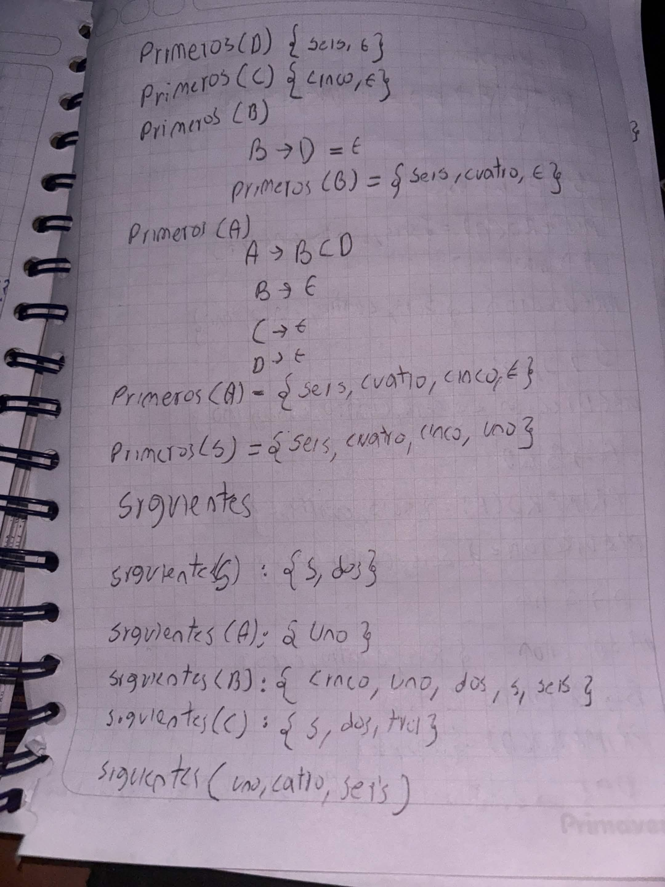
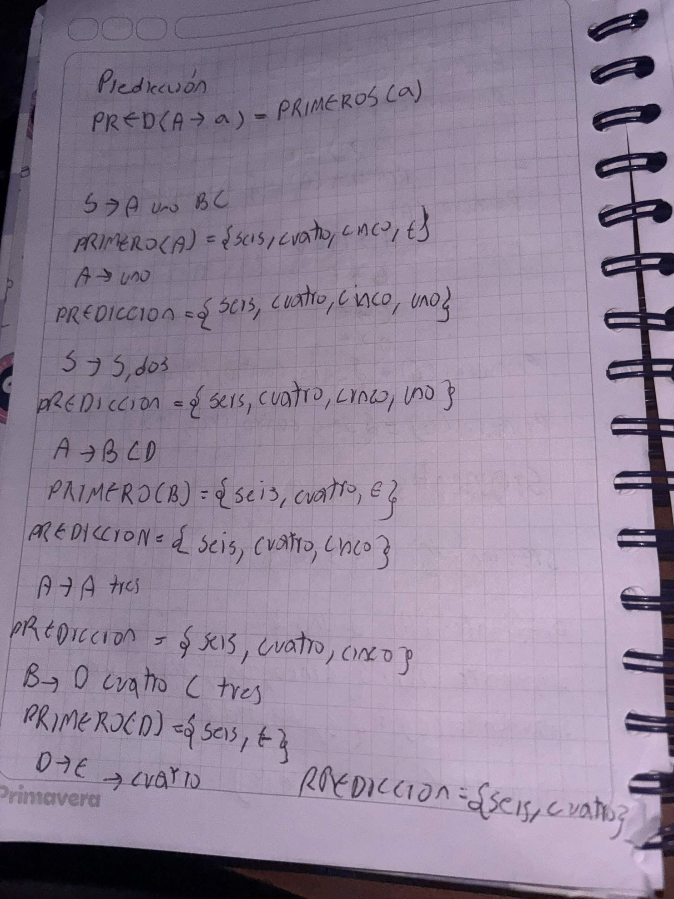
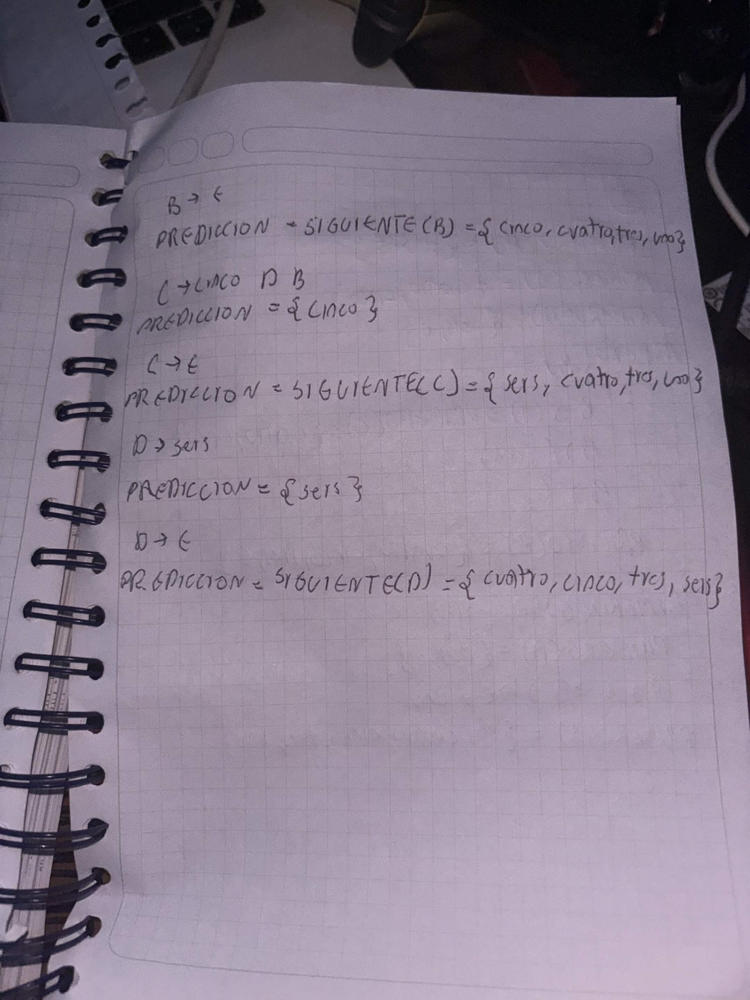
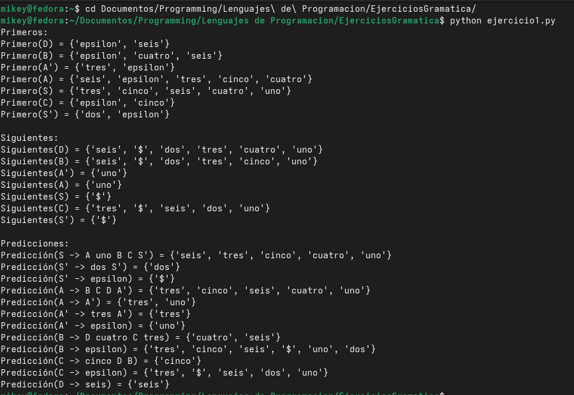
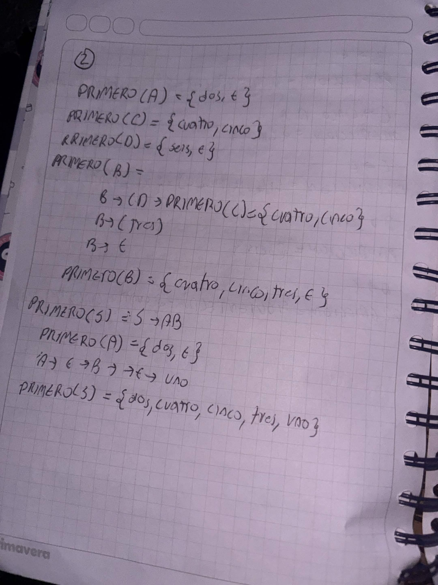
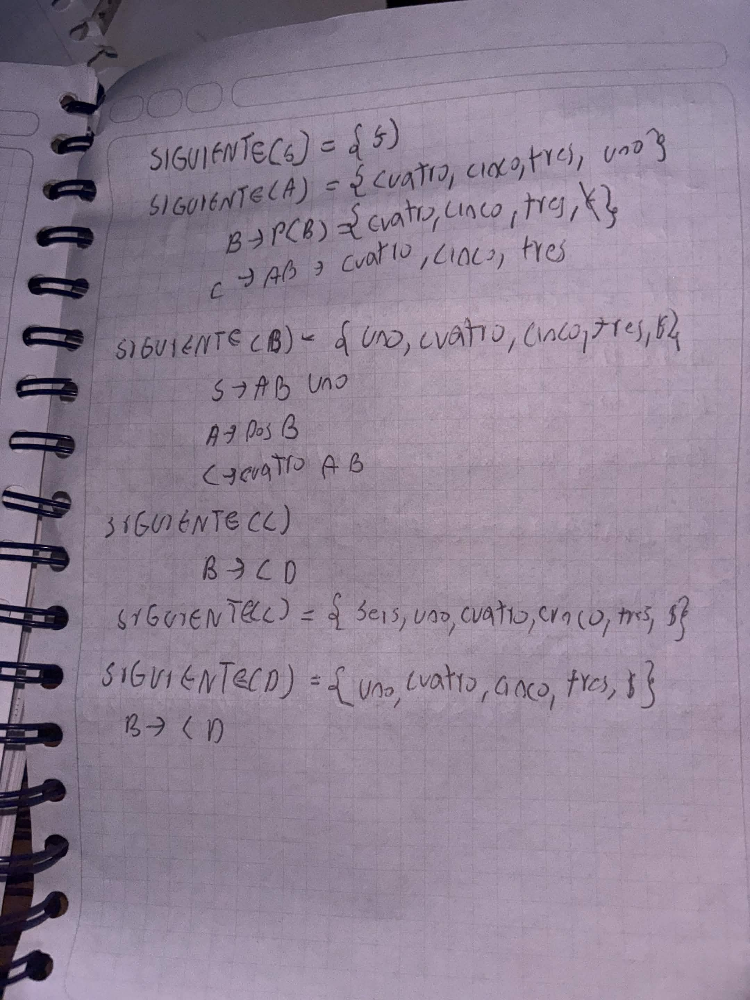
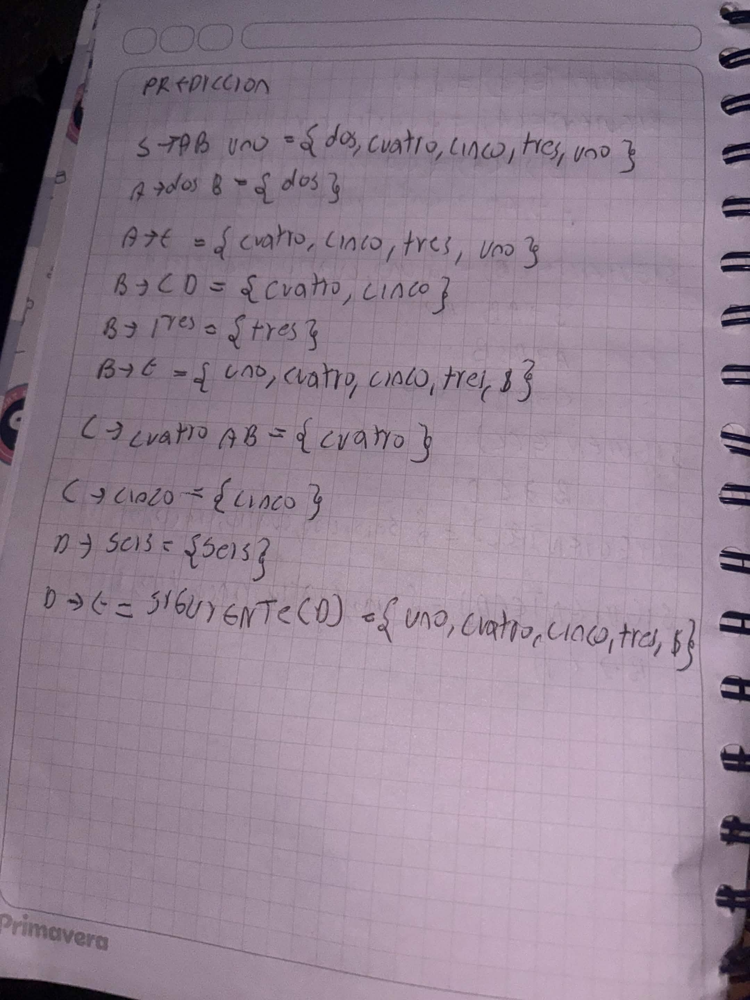
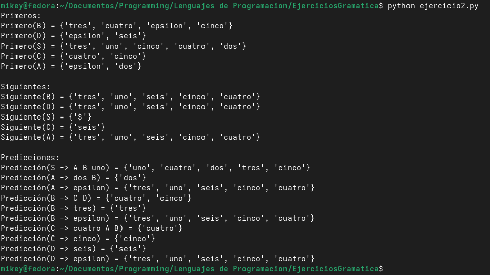

# ADS Recursivo

# Introducción

El Análisis Sintáctico es una fase fundamental en el diseño y construcción de procesadores de lenguajes y compiladores. Este proyecto se enfoca en el **Análisis Sintáctico Descendente (ASD)**, específicamente diseñado para gramáticas de tipo **LL(1)**.

# Objetivo General

Implementar un sistema en Python capaz de calcular conjuntos de Primeros, Siguientes y Predicción para gramáticas dentro de las diapositivas presentadas dentro de la clase. El sistema debe garantizar un Análisis Sintáctico Descendente (LL1)

# Ejercicio 1

## Gramática:

- `S  -> A uno B C S'`
- `S' -> dos S' | ε`
- `A  -> B C D A' | A'`
- `A' -> tres A' | ε`
- `B  -> D cuatro C tres | ε`
- `C  -> cinco D B | ε`
- `D  -> seis | ε`

# ## Algoritmos Implementados

1. **Conjuntos de Primeros:** Identifica los símbolos terminales con los que puede iniciar la derivación de cualquier cadena.
2. **Conjuntos de Siguientes:** Determina qué terminales pueden aparecer inmediatamente a la derecha de un no terminal dentro de una forma sentencial válida.
3. **Conjuntos de Predicción:** Evalúa las producciones cruzando Primeros y Siguientes (especialmente en reglas que derivan en `ε`) para que el analizador sepa exactamente qué regla aplicar según el token de entrada.

# Gramática rectificada a mano







# ¿Cómo compilarlo

1. Acceder al directorio del proyecto desde la terminal o consola
2. Ejecutar el archivo python de la siguiente forma

```bash
python ejercicio1.py
```

# Código Fuente:

```python

gramatica_ej1 = {
    'S': [['A', 'uno', 'B', 'C', "S'"]],
    "S'": [['dos', "S'"], ['epsilon']],
    'A': [['B', 'C', 'D', "A'"], ["A'"]],
    "A'": [['tres', "A'"], ['epsilon']],
    'B': [['D', 'cuatro', 'C', 'tres'], ['epsilon']],
    'C': [['cinco', 'D', 'B'], ['epsilon']],
    'D': [['seis'], ['epsilon']]
}

no_terminales = {'S', "S'", 'A', "A'", 'B', 'C', 'D'}
terminales = {'uno', 'dos', 'tres', 'cuatro', 'cinco', 'seis'}
simbolo_inicial = 'S'
memo_primeros = {}
memo_siguientes = {}
predicciones = {}

def get_primeros(simbolo, visitados=None):
    if visitados is None:
        visitados = set()

    # Casos base
    if simbolo in memo_primeros:
        return memo_primeros[simbolo]
    if simbolo in terminales or simbolo == 'epsilon':
        return {simbolo}

    # Función para evitar un bucle infinito.
    if simbolo in visitados:
        return set()

    visitados.add(simbolo)
    resultado = set()

    # Llamada recursiva buscando en las producciones
    for produccion in gramatica_ej1[simbolo]:
        for s in produccion:
            # Calcular primeros del símbolo interno
            primeros_s = get_primeros(s, visitados.copy())
            resultado.update(primeros_s - {'epsilon'})
            if 'epsilon' not in primeros_s:
                break
        else:
            resultado.add('epsilon')

    memo_primeros[simbolo] = resultado
    return resultado

# Función para evaluar una regla completa
def primeros_de_cadena(cadena):
    resultado = set()
    if not cadena:
        return {'epsilon'}
    for simbolo in cadena:
        primeros_s = get_primeros(simbolo)
        resultado.update(primeros_s - {'epsilon'})
        if 'epsilon' not in primeros_s:
            return resultado
    resultado.add('epsilon')
    return resultado

def get_siguientes(simbolo, visitados=None):
    if visitados is None:
        visitados = set()

    # Casos base
    if simbolo in memo_siguientes:
        return memo_siguientes[simbolo]
    if simbolo in visitados:
        return set()

    visitados.add(simbolo)
    resultado = set()

    if simbolo == simbolo_inicial:
        resultado.add('$')

    # Búsqueda en toda la gramática
    for nt, producciones in gramatica_ej1.items():
        for produccion in producciones:
            for i, s in enumerate(produccion):
                if s == simbolo:
                    resto_derecha = produccion[i+1:]
                    primeros_resto = primeros_de_cadena(resto_derecha)

                    resultado.update(primeros_resto - {'epsilon'})

                    # Si deriva en epsilon, hereda los Siguientes del padre
                    if 'epsilon' in primeros_resto:
                        if nt != simbolo: # Evita la redundancia de llamarse a sí mismo
                            resultado.update(get_siguientes(nt, visitados.copy()))

    memo_siguientes[simbolo] = resultado
    return resultado

for nt in no_terminales:
    get_primeros(nt)

for nt in no_terminales:
    get_siguientes(nt)

for nt, producciones in gramatica_ej1.items():
    for produccion in producciones:
        regla_texto = f"{nt} -> {' '.join(produccion)}"
        primeros_produccion = primeros_de_cadena(produccion)

        conjunto_prediccion = primeros_produccion - {'epsilon'}

        if 'epsilon' in primeros_produccion:
            conjunto_prediccion.update(memo_siguientes[nt])

        predicciones[regla_texto] = conjunto_prediccion

print("Primeros:")
for nt in no_terminales:
    print(f"Primero({nt}) = {memo_primeros[nt]}")

print("\nSiguientes:")
for nt in no_terminales:
    print(f"Siguientes({nt}) = {memo_siguientes[nt]}")

print("\nPredicciones:")
for regla, prediccion in predicciones.items():
    print(f"Predicción({regla}) = {prediccion}")
```

# Explicación del Código:

El script `ejercicio_1.py` está estructurado en bloques lógicos secuenciales que emulan el comportamiento matemático del Análisis Sintáctico Descendente. A continuación, se detallan los componentes clave de su arquitectura:

### 1. Representación Estructural de la Gramática

La gramática se mapea utilizando diccionarios. Las claves representan los símbolos No Terminales (ej. `'S'`, `'A'`), y los valores son listas de listas, donde cada sublista representa una producción (ej. `['A', 'uno', 'B', 'C', "S'"]`).

### 2. Control de Ciclos (`visitados`)

Dado que las gramáticas pueden tener dependencias intrincadas, una recursividad ingenua provocaría un desbordamiento de pila. Para evitarlo, el código implementa dos capas de seguridad:

- **Caché (`memo_primeros`, `memo_siguientes`):** Guarda los conjuntos ya calculados para no repetir procesamiento, optimizando el tiempo de ejecución.
- **Control de estado (`visitados`):** Cada llamada recursiva pasa un conjunto (set) con los símbolos que están siendo evaluados en esa rama. Si la función detecta que el símbolo actual ya está en `visitados`, retorna un conjunto vacío, rompiendo cualquier bucle infinito.

### 3. Función `get_primeros(simbolo)`

Esta función recursiva determina con qué terminales puede iniciar un símbolo.

- **Caso Base:** Si el símbolo es un terminal o `ε`, retorna el símbolo mismo.
- **Caso Recursivo:** Itera sobre las producciones del No Terminal. Si el primer símbolo de la producción deriva en `ε`, continúa evaluando el siguiente símbolo de la cadena llamando a la función auxiliar `primeros_de_cadena()`.

### 4. Función `get_siguientes(simbolo)`

Calcula qué terminales pueden aparecer a la derecha de un No Terminal. El algoritmo escanea toda la gramática buscando el `simbolo` en las partes derechas de las producciones y aplica las reglas formales:

- **Regla 1:** Agrega el símbolo de fin de cadena (`$`) al símbolo inicial.
- **Regla 2a:** Si hay algo a la derecha del símbolo, calcula sus Primeros (sin `ε`) y los agrega.
- **Regla 2b:** Si lo que está a la derecha puede derivar en `ε` (o si no hay nada a la derecha), hace una llamada recursiva para heredar los Siguientes del No Terminal.

### 5. Conjuntos de Predicción

Evalúa los Primeros de cada producción completa; si la producción no genera `ε`, su predicción son sus Primeros. Si la producción genera `ε`, se le unen los Siguientes del No Terminal que la produce.

# Resultados y capturas de la ejecución

Tal como se muestra dentro de los ejercicios hechos a mano, el resultado es el mismo, pero esta vez representado dentro del código y ordenado.



# Conclusión del Ejercicio 1:

Se puede concluir que en este ejercicio se ilustra el funcionamiento de un compilador, específicamente en la fase de análisis sintáctico, donde se utilizan algoritmos para determinar si una cadena de entrada pertenece a una gramática formal. De la misma forma, se utilizó un enfoque de recursividad pura para el cálculo de los conjuntos de Primeros y Siguientes, lo que permitió obtener los conjuntos de predicción para cada producción de la gramática.

# Ejercicio 2:

# Gramática

- `S -> A B uno`
- `A -> dos B | ε`
- `B -> C D | tres | ε`
- `C -> cuatro A B | cinco`
- `D -> seis | ε`

# Explicación del ejercicio2:

Este usa el mismo algoritmo del ejercicio 1, cambiando cosas como la gramática y el símbolo inicial.

A diferencia del primer caso, el diccionario `gramatica_ej2` se construyó mapeando exactamente la gramática original del problema, no fue necesario introducir símbolos adicionales. Esto demuestra que el algoritmo es capaz de procesar gramáticas estándar sin modificaciones previas, siempre que cumplan con las condiciones LL(1).

# Gramática Rectificada a Mano







# Código Fuente:

```python

# Definición de la gramática y símbolos
gramatica_ej1 = {
    'S': [['A', 'uno', 'B', 'C', "S'"]],
    "S'": [['dos', "S'"], ['epsilon']],
    'A': [['B', 'C', 'D', "A'"], ["A'"]],
    "A'": [['tres', "A'"], ['epsilon']],
    'B': [['D', 'cuatro', 'C', 'tres'], ['epsilon']],
    'C': [['cinco', 'D', 'B'], ['epsilon']],
    'D': [['seis'], ['epsilon']]
}

no_terminales = {'S', "S'", 'A', "A'", 'B', 'C', 'D'}
terminales = {'uno', 'dos', 'tres', 'cuatro', 'cinco', 'seis'}
simbolo_inicial = 'S'
memo_primeros = {}
memo_siguientes = {}
predicciones = {}

def get_primeros(simbolo, visitados=None):
    if visitados is None:
        visitados = set()

    # Casos base
    if simbolo in memo_primeros:
        return memo_primeros[simbolo]
    if simbolo in terminales or simbolo == 'epsilon':
        return {simbolo}

    if simbolo in visitados:
        return set()

    visitados.add(simbolo)
    resultado = set()

    for produccion in gramatica_ej1[simbolo]:
        for s in produccion:
            primeros_s = get_primeros(s, visitados.copy())
            resultado.update(primeros_s - {'epsilon'})
            if 'epsilon' not in primeros_s:
                break
        else:
            resultado.add('epsilon')

    memo_primeros[simbolo] = resultado
    return resultado

def primeros_de_cadena(cadena):
    resultado = set()
    if not cadena:
        return {'epsilon'}
    for simbolo in cadena:
        primeros_s = get_primeros(simbolo)
        resultado.update(primeros_s - {'epsilon'})
        if 'epsilon' not in primeros_s:
            return resultado
    resultado.add('epsilon')
    return resultado

def get_siguientes(simbolo, visitados=None):
    if visitados is None:
        visitados = set()

    # Casos base
    if simbolo in memo_siguientes:
        return memo_siguientes[simbolo]
    if simbolo in visitados:
        return set()

    visitados.add(simbolo)
    resultado = set()

    if simbolo == simbolo_inicial:
        resultado.add('$')

    for nt, producciones in gramatica_ej1.items():
        for produccion in producciones:
            for i, s in enumerate(produccion):
                if s == simbolo:
                    resto_derecha = produccion[i+1:]
                    primeros_resto = primeros_de_cadena(resto_derecha)

                    resultado.update(primeros_resto - {'epsilon'})

                    if 'epsilon' in primeros_resto:
                        if nt != simbolo:
                            resultado.update(get_siguientes(nt, visitados.copy()))

    memo_siguientes[simbolo] = resultado
    return resultado


for nt in no_terminales:
    get_primeros(nt)

for nt in no_terminales:
    get_siguientes(nt)

for nt, producciones in gramatica_ej1.items():
    for produccion in producciones:
        regla_texto = f"{nt} -> {' '.join(produccion)}"
        primeros_produccion = primeros_de_cadena(produccion)

        conjunto_prediccion = primeros_produccion - {'epsilon'}

        if 'epsilon' in primeros_produccion:
            conjunto_prediccion.update(memo_siguientes[nt])

        predicciones[regla_texto] = conjunto_prediccion

print("Primeros:")
for nt in no_terminales:
    print(f"Primero({nt}) = {memo_primeros[nt]}")

print("\nSiguientes:")
for nt in no_terminales:
    print(f"Siguiente({nt}) = {memo_siguientes[nt]}")

print("\nPredicciones:")
for regla, prediccion in predicciones.items():
    print(f"Predicción({regla}) = {prediccion}")

```

# ¿Cómo Compilar?

```bash
python ejercicio2.py
```

# Resultados y capturas de la ejecución



# Conclusión del Ejercicio 2

El desarrollo de este segundo escenario resalta la eficiencia de trabajar con gramáticas que ya están estructuralmente optimizadas para el análisis predictivo. El script procesó las reglas de producción en su estado puro, sin requerir símbolos auxiliares ni alteraciones matemáticas previas. Esto validó de manera práctica que las funciones recursivas para calcular los _Primeros_, _Siguientes_ y _Predicciones_ son eficientes y escalables.

# Conclusión General de la actividad:

- **Teoría y Práctica:** Se aplicaron conceptos tales como los conjuntos de Primeros y Siguientes y convertir gramáticas a LL(1) para construir compiladores exactos y libres de ambigüedades.

- **Excelencia Algorítmica:** Se usó recursividad con memoización superó a los métodos iterativos clásicos, ya que resuelve eficientemente las dependencias cíclicas y símbolos vacíos (ε) mientras optimiza la memoria y velocidad.

- **Fundamentación Predictiva:** Se obtuvieron predicciones exactas y mutuamente excluyentes lo que garantiza un análisis veloz en tiempo lineal O(n), eliminando el retroceso y facilitando la detección rápida de errores.
